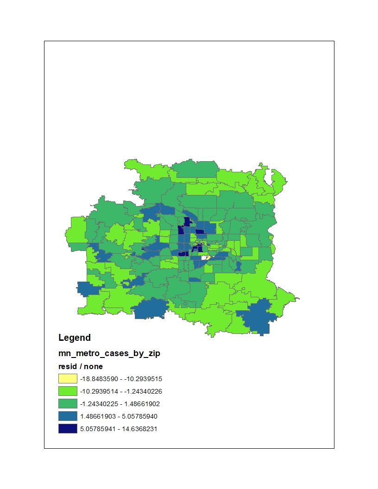

```{r setup, include=FALSE}
knitr::opts_chunk$set(echo = TRUE)
```

```{r, warning=FALSE, message=FALSE}
library(broom) 
library(tidyverse)
library(janitor)
options(scipen=999)
library(rmarkdown)
library(knitr)
library(DT)
library(tidycensus)
library(purrr)
library(sf)
library(spdep)


#Only metro area zip codes with COVID rates, census income and race attached
metro <- read_csv('metro.txt') %>% clean_names()

#All zip codes in MN with COVID rates and race attached
#mn <- read_csv('mn.csv') %>% clean_names()

# remove three zip codes where median household income wasn't available
metro <-  metro %>% filter(!is.na(estimate))

#Import shapefile with COVID rates, census income and race attached
shp_name <- "metro_with_income.shp"
shape_sf <- st_read(shp_name)

#We coerce the sf object into a new sp object
shape_sp <- as(shape_sf, "Spatial")


#Then we create a list of neighbours using the Queen criteria
#w <- poly2nb(ncovr_sp, row.names=ncovr_sp$GEOID10)


#Now we can generate the row standardise spatial weight matrix and the Moran Scatterplot.
#wm <- nb2mat(w, style='B')
#rwm <- mat2listw(wm, style='W')


```


```{r, warning=FALSE, message=FALSE, include=FALSE}


# select column to work with
s <- subset(shape_sp, select=c("GEOID10"))

#find neighbors
nb <- poly2nb(s, queen=TRUE)

#create weighting
lw <- nb2listw(nb, style="W", zero.policy=TRUE) # equal weights


```


# Spatial regression models

```{r, warning=FALSE, message=FALSE}
#run model with pct_nonwhite and median household income (estimate)

model1 <-  spautolm(formula = cases_per_ ~ pct_nonwhi + estimate,
data = shape_sp, listw=lw)

summary(model1)
```


```{r, warning=FALSE, message=FALSE,}

#model with pct black and median household income

model2 <-  spautolm(formula = cases_per_ ~ pct_black + estimate,
data = shape_sp, listw=lw)

summary(model2)
```


#Non-spatial analysis

# Look at distribution of zip codes by pct_nonwhite
```{r}
ggplot(data = metro) +
  geom_histogram(aes(x = pct_nonwhi), bins = 30, fill = "lightblue")
```

# Put zip codes into quartiles
COVID rates per 1,000 in each quartile
```{r}
metro$race_quartile <- ntile(metro$pct_nonwhi, 4) 

metro %>% group_by(race_quartile) %>% summarise(qt_cases = sum(cases_nume),
                                                qt_pop = sum(pop_total)) %>% 
  mutate(qt_rate = (qt_cases/qt_pop)*1000)
```


# Metro area - pct non-white and COVID cases per 1,000
```{r}
nonspatial_model1 <-  lm(cases_per ~ pct_nonwhi, data=metro )
tidy(nonspatial_model1)

#with each percentage point increase in diversity (pct non-white), there will be - on average - 20 more COVID cases per 1,000
```


```{r}
summary(nonspatial_model1)$r.squared 
```


```{r}
ggplot(data = metro , aes(x = cases_per, y = pct_nonwhi)) +
  geom_point() +
  geom_smooth(method="lm", se=FALSE)+
  labs(x = "Cases per 1,000", y = "Pct non-white population", title="Metro Zip codes: COVID cases and POC") +
  theme_minimal()

ggsave( "./covid_nonwhite_scatter.jpg", width=8, height=5, units="in", dpi="print")
```

# Facet the same data based on the primary minority population in that zip
```{r}
ggplot(data = metro , aes(x = cases_per, y = pct_nonwhi)) +
  geom_point() +
  geom_smooth(method="lm", se=FALSE)+
  facet_wrap(vars(largest_mi)) +
  labs(x = "Cases per 1,000", y = "Pct non-white population", title="Metro Zip codes: COVID cases and POC") +
  theme_minimal()

ggsave( "./covid_nonwhite_facet.jpg", width=8, height=5, units="in", dpi="print")
```


# Multiple regression: Income and Pct non-white (metro area)
```{r}
multi_nonwhite_income_metro <-  lm(cases_per ~ pct_nonwhi + estimate, data=metro )
tidy(multi_nonwhite_income_metro)


```

#compare the multiple regression to the race model
```{r}
anova(multi_nonwhite_income_metro, nonspatial_model1)
```


# Compare predicted values to actual by zip code
Uses the  model with race and income<br>
This was used to assess whether spatial regression was necessary<br>
Residual pattern is too similar to the COVID rate pattern

```{r}
augment(nonspatial_model1, data=metro) %>% select(geoid10, largest_mi, cases_per, estimate, pct_nonwhi, .fitted, .resid) %>% arrange(desc(pct_nonwhi))


residuals <-  augment(nonspatial_model1, data=metro) %>% select(geoid10, largest_mi, cases_per, estimate, pct_nonwhi, .resid) %>% rename(resid= .resid) %>% mutate(geoid10=as.character(geoid10))

#write.csv(residuals, 'residuals.csv', row.names=FALSE)
#this is the data that I mapped in ArcGIS 

residuals %>% filter(pct_nonwhi >=.5)
```


# Map of residuals





# Map of COVID rates


